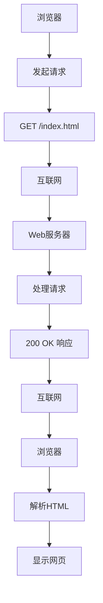

## [HTTP面试题](https://www.xiaolincoding.com/network/2_http/http_interview.html)

## 一、理解 HTTP 定义

### 思考与自测：合上资料，尝试用自己的话解释：

1. “协议”在计算机世界和现实世界有何相似？\
          回答：就跟我们现实当中签订的双方合同、多方合同相类似，`协`指的是参与者必须是两个人或者两个人以上，`议`指的是参与者必须遵循双方规定的约定的规范。HTTP就是一种计算机之间的通信协议。计算机和计算机之间用各自听得懂的语言来进行交流，交流过程中需要满足双方约定好的规范，例如：规定数据长度之类的等等。
2. “传输”为什么是双向的，且允许“中转”？\
          回答：HTTP采用的是`请求`和`响应`的模型，当客户端发送请求时，服务端作为响应方；反之亦然。允许中转，但要求中间人必须遵循HTTP协议，其实总体来看是两点之间通信的一种传输规范，不再乎有多少个中间方。
3. “超文本”中的“超”体现在哪里？（提示：链接是关键）\
          回答：文本只是普通的文字，超文本是文字、图片、视频等多项结合体，同时具备超链接的功能，也就是可以从一个超文本跳转到另外一个超文本，HTML就是典型的超文本文件，内部存在各种图片、视频等链接，通过浏览器的解释，从而让普通的文件具备显示各种资源的能力。

## 二、攻克GET与POST方法
### 1. GET方法简介
- 用于获取资源，资源可以是HTML文件、图片、视频等。
- 请求参数一般在URL中，用`?`分隔，后面跟着键值对，例如：`?name=张三&age=18`
- URL的格式只可以包含ASCII字符
- HTTP没有限制URL的长度，但浏览器对URL的长度有限制

### 2. POST方法简介
- 通过请求负荷（请求体）来对服务器的文件资源进行处理，具体的处理依据资源类型而不同
- 处理的数据存储在请求体中
- Body的大小没有限制，可以发送任意大小、任意格式的数据

### 3. 安全和幂等
- 安全：操作没有对服务器的文件资源进行处理、破坏
- 幂等：多次操作的结果都是一样的

### 4. GET 和 POST 方法都是安全和幂等的吗？
- GET请求只是访问服务器的资源文件，并不会去处理/破坏资源文件，是安全的；而且多次访问一般都会是同一个结果，所以GET请求是可以缓存的，是幂等且可以缓存；也就是说对于访问同一个资源文件的情况下，后续浏览器可以直接读取缓存，不需要发送网络请求，所以是安全且幂等、可以缓存的。
- POST请求具有破坏服务器资源文件的能力，可以通过请求体（Body）当中对指定文件做出添加等操作（例如：留言），所以不是安全的，而且多次发送POST请求有可能会多次破坏资源文件（多次创造新的资源到文件中），所以是不幂等、且不可以缓存的。
- AI修正：幂等性取决于服务器如何实现这个POST接口。根据HTTP标准，POST不保证幂等。例如，提交一个订单（POST /orders）多次，可能会创建多个订单，这就是不幂等的。但有些POST接口可以被设计成幂等的（例如，反复提交同一份数据，服务器会去重，只产生一个结果）。不过，在面试和通用认知中，默认认为POST是不幂等的。

### 5. 思考：为什么登录一定要用POST而不用GET？（结合“安全性”和“幂等性”思考）
回答：我认为也可能是如果是用GET请求，会将账号密码明文显示到url当中，很容易遭到泄露风险，但是通过POST将数据存储在请求体当中，但是由于HTTP是明文传输，所以通过抓包的形式依然会被泄露，但可能比GET安全一点点吧。对于安全性来说，有可能是因为如果用GET请求只是获取指定匹配文件资源，但是并不会修改文件资源，这对于登录的时候可以同步注册来说是不对的，利用POST请求可以将新注册的个人信息存储到服务器当中。  
#### AI修正：
1. 安全性：GET被定义为安全（只读）操作，而登录会在服务器创建会话状态，具有副作用。
2. 幂等性：GET被定义为幂等操作，而多次登录可能产生多个会话，不符合幂等性。
3. 此外，从实际安全风险考虑，如果使用GET登录，敏感参数会明文暴露在URL、浏览器历史、服务器日志等多个地方，极大地增加了泄露风险。而POST通过请求体传输数据，避免了这一问题，只在服务器端处理数据，不会暴露在URL当中。

## 三、掌握关键状态码
1. 常见状态码
    - 200 OK ：是最常见的成功状态码，代表服务器成功处理请求，返回请求的资源。如果是非HEAD请求，服务器会返回请求的资源；如果是HEAD请求，服务器不会返回请求的资源，只返回响应头。
    - 304 Not Modified ：代表服务器成功处理请求，但是资源没有被修改，客户端可以直接从缓存中读取资源。
    - 404 Not Found ：代表服务器无法找到请求的资源，客户端需要检查URL是否正确。
    - 500 Internal Server Error ：代表服务器内部发生了错误，无法处理请求。
2. 思考自测
    - 当你看到 304状态码时，浏览器实际是从哪里获取的资源？  
        回答：浏览器会从缓存中读取资源，属于协商缓存。
    - 当你看到 500状态码时，浏览器会如何处理？  
        回答：说明服务器内部发生了错误，无法处理请求。

## 四、常见的字段
- Host 字段：客户端发送请求时，用来指定服务器的域名，例如：`www.baidu.com`
- Content-Length 字段：服务器返回响应时，用来指定响应体的长度，单位是字节。
- Connection 字段：客户端发送请求时，用来指定与服务器的连接方式，例如：`keep-alive`等。
- Content-Type 字段：服务器返回响应时，用来指定响应体的类型，例如：`text/html`、`application/json`等。
- Content-Encoding 字段：服务器返回响应时，用来指定响应体的压缩方式，例如：`gzip`、`deflate`等。

## 五、HTTP 请求响应流程
