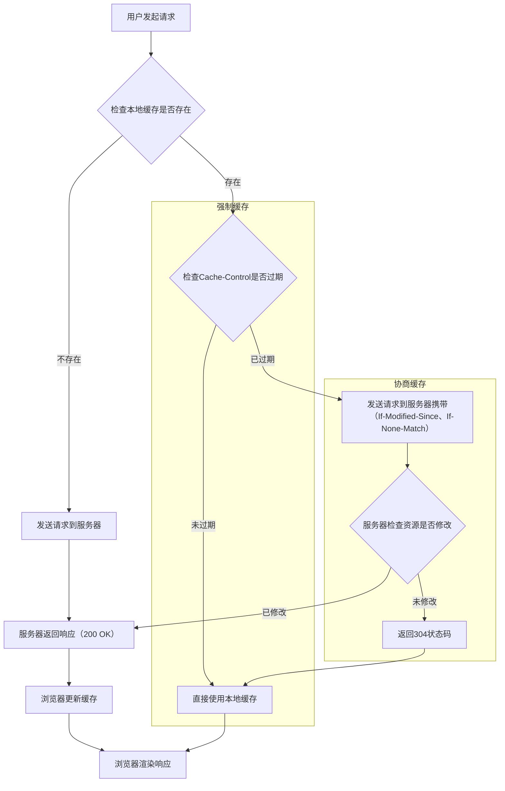

## [HTTP面试题](https://www.xiaolincoding.com/network/2_http/http_interview.html)
## 一、建立顶层概念

### 1. 为什么需要缓存？

- 由于HTTP是请求响应模型，所以有可能会发送相同的请求，导致服务器返回相同的响应，所以可以缓存请求和响应。这样子下次请求前先判断是否存在对应的缓存条目，如果有，直接从缓存中读取，没有，再发送请求到服务器。

### 2. 缓存的实现方式有哪些？

- 强制缓存
- 协商缓存

## 二、攻克”强制缓存”

### 1. 什么是强制缓存

- 强制缓存指的是只要浏览器判断缓存没有过期，则直接使用浏览器的本地缓存，决定是否使用缓存的主动性在于浏览器这边。

### 2. 强制缓存的两个字段有哪些？

- Cache-Control：相对时间
- Expires：绝对时间

### 3. 流程：（当响应头当中同时包含Cache-Control和Expires字段时，优先级Cache-Control高）

- 第一次请求由于没有缓存，所以会发送请求到服务器，服务器返回响应（包含Cache-Control和Expires字段的响应），浏览器会将响应缓存起来。
- 再次请求会先去请求对应的缓存条目，判断缓存是否过期，如果没有过期，直接从缓存中读取响应，不会发送请求到服务器。
- 如果缓存过期，会发送请求到服务器，服务器返回新的响应，浏览器会将新的响应缓存起来。

## 三、攻克”协商缓存”（在强制缓存未命中时使用）

### 1. 什么是协商缓存？

- 协商缓存指的是浏览器发送请求给服务器，服务器告诉浏览器缓存是否过期，浏览器根据服务器的判断，决定是否使用缓存。

### 2. 协商缓存的两个字段有哪些？

- Last-Modified：资源最后修改的时间
- ETag：资源的唯一标识

### 3. 只有Last-Modified字段时，流程：

- 当强制缓存未命中，浏览器会发送请求，请求头当中会包含If-Modified-Since字段，值为Last-Modified字段的值。
- 服务器会判断根据对应的资源文件的Last-Modified字段和请求头中的If-Modified-Since字段的值进行比较
  - 如果 Last-Modified > If-Modified-Since，说明服务器的资源更加新，说明资源被修改，会返回200状态码，浏览器会将新的响应缓存起来。
  - 如果 Last-Modified <= If-Modified-Since，说明服务器的资源没有被修改，会返回304状态码，浏览器会从缓存中读取资源。

### 4. 只有ETag字段时，流程：

- 当强制缓存未命中，浏览器会发送请求，请求头当中会包含If-None-Match字段，值为ETag字段的值。
- 服务器会判断根据对应的资源文件的ETag字段和请求头中的If-None-Match字段的值进行比较
  - 如果 ETag == If-None-Match，说明服务器的资源没有被修改，会返回304状态码，浏览器会从缓存中读取资源。
  - 如果 ETag != If-None-Match，说明服务器的资源被修改，会返回200状态码，浏览器会将新的响应缓存起来。

### 5. 两个字段都有的时，流程：

- 当强制缓存未命中，浏览器会发送请求，请求头当中会包含If-Modified-Since字段和If-None-Match字段，值分别为Last-Modified字段的值和ETag字段的值。
- 服务器会判断根据对应的资源文件的Last-Modified字段和ETag字段和请求头中的If-Modified-Since字段和If-None-Match字段的值进行比较，ETag字段优先级高，先判断ETag字段，当ETag字段相同时，再判断Last-Modified字段。
  - 如果 ETag == If-None-Match，说明服务器的资源没有被修改，去Last-Modified字段判断。
    - 如果 Last-Modified > If-Modified-Since，说明服务器的资源更加新，说明资源被修改，会返回200状态码，浏览器会将新的响应缓存起来。
    - 如果 Last-Modified <= If-Modified-Since，说明服务器的资源没有被修改，会返回304状态码，浏览器会从缓存中读取资源。
  - 如果 ETag != If-None-Match，说明服务器的资源被修改，会返回200状态码，浏览器会将新的响应缓存起来。

### 6. ETag的优势：

- 在没有修改文件内容情况下文件的最后修改时间可能也会改变，这会导致客户端认为这文件被改动了，从而重新请求；
- 可能有些文件是在秒级以内修改的，If-Modified-Since 能检查到的粒度是秒级的，使用 Etag就能够保证这种需求下客户端在 1 秒内能刷新多次；
- 有些服务器不能精确获取文件的最后修改时间。

## 四、缓存决策流程

### 1.流程图：

### 2.详细流程说明

1. **用户发起请求**：用户在浏览器中输入URL或点击链接
2. **检查本地缓存**：
   - 如果缓存不存在，直接发送请求到服务器
   - 如果缓存存在，检查强制缓存（Cache-Control）是否过期
3. **强制缓存检查**：
   - **未过期**：直接使用本地缓存，不发送请求到服务器
   - **已过期**：进入协商缓存流程
4. **协商缓存流程**：
   - 浏览器发送请求到服务器，携带缓存标识（If-Modified-Since和If-None-Match）
   - 服务器优先检查ETag，再检查Last-Modified
   - **资源未修改**：服务器返回304状态码，浏览器使用本地缓存
   - **资源已修改**：服务器返回200状态码和新的资源，浏览器更新缓存
5. **返回响应**：
   - 浏览器渲染响应

### 3.缓存标识说明

- **强制缓存**：
  - Cache-Control：相对时间（如max-age=3600）
  - Expires：绝对时间
  - 优先级：Cache-Control > Expires
- **协商缓存**：
  - Last-Modified/If-Modified-Since：基于文件修改时间
  - ETag/If-None-Match：基于文件内容的唯一标识
  - 优先级：ETag > Last-Modified

